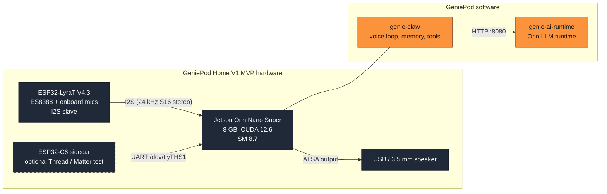
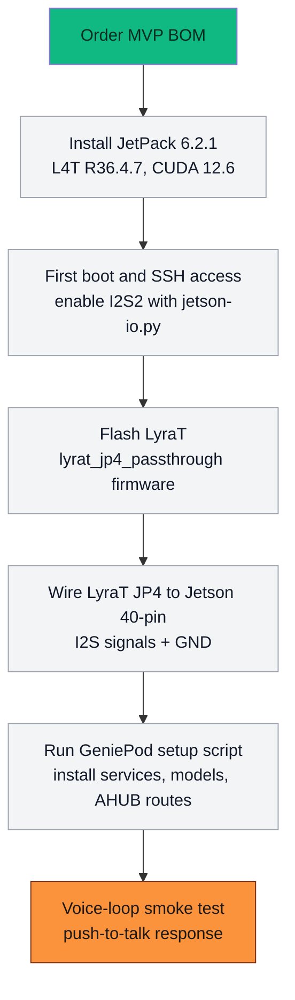

# genie-hardware

Hardware documentation for **GeniePod Home V1**.

Current status: **MVP testing**. The working reference build uses
off-the-shelf development boards, hand wiring, and the current GeniePod
software stack. Custom PCB, enclosure, and product-design assets are planned,
but they are not the source of truth yet.

## Home V1 Target Hardware

GeniePod Home V1 is the first integrated home appliance target. The MVP in
this repo validates the stack with dev boards first; the custom Home V1
hardware is expected to consolidate those functions into a purpose-built
carrier, enclosure, and audio layout.

| Subsystem | Home V1 direction |
| --- | --- |
| Compute | Jetson Orin Nano-class SoM running the GeniePod voice stack, LLM runtime, and local services |
| Audio input | 4 analog microphones in a far-field array, with a dedicated audio ADC/front end and physical mute path |
| Audio output | 2-speaker playback path for voice responses, alerts, and room audio testing |
| Storage | Onboard M.2 NVMe SSD for the OS image, models, logs, configuration, and OTA staging |
| Security | TPM 2.0 security module for device identity and future sealed-storage / disk-encryption flows |
| Wireless | WiFi and BLE connectivity for setup, local network access, and device management |
| Thread / Matter | Thread border-router path using a radio co-processor connected to the Jetson host |
| Status lighting | RGBW LED status system for wake, listening, processing, muted, error, setup, and idle states |
| Physical controls | Hardware microphone mute, volume controls, and a setup/pairing control |
| External I/O | USB-C power, Ethernet, and hidden service/debug USB access; no public display output in V1 |
| Enclosure | Voice-first home form factor with top mic zone, separated speaker path, visible privacy/status cues, and rear/bottom I/O |

> **Verified MVP:** Jetson Orin Nano Super + ESP32-LyraT V4.3, tested with
> `genie-claw` alpha.7 on 2026-05-13.

## Scope

This repo is only about **GeniePod Home V1** hardware.

It currently documents:

1. **MVP testing build** — the board-level setup that works today.
2. **Home V1 interface board** — planned replacement for loose jumper wiring.
3. **Home V1 enclosure** — planned developer enclosure around the MVP stack.
4. **Home V1 product design** — planned industrial-design notes for this device.

It does not define other GeniePod products or future SKUs.

Everything here is licensed [CERN-OHL-S v2](LICENSE.md).

## MVP System

## Folder Map

| Folder | Status | What it holds |
| --- | --- | --- |
| [`mvp/`](mvp/) | working MVP test build | BOM, wiring, and setup notes for the off-the-shelf reference build |
| [`schematic/`](schematic/) | planned | KiCad schematics for the Home V1 interface board |
| [`pcb/`](pcb/) | planned | PCB layouts, Gerbers, fab outputs, and renders |
| [`enclosure/`](enclosure/) | planned | CAD for the Home V1 MVP/developer enclosure |
| [`product-design/`](product-design/) | planned | Home V1 industrial-design and packaging notes |
| [`images/`](images/) | active | MVP photos and repo diagrams |

## MVP at a Glance

The current MVP test build:

| Component | Part | Approx USD |
| --- | --- | --- |
| Compute | Jetson Orin Nano Super Devkit (8 GB) | $499 |
| Mic frontend | ESP32-LyraT V4.3 (ES8388 + 3 onboard mics) | $30-40 |
| Storage | microSD A2 U3 64 GB+ | $15 |
| Audio out | USB-A headphone or 3.5 mm speaker | $5-30 |
| Wiring | 40-pin GPIO ribbon + Dupont jumpers | $5 |
| **Total core MVP** | | **~$550** |

Optional for testing: ESP32-C6 sidecar for Thread/Matter, upgraded speakers,
and HDMI display for first boot.

Full BOM: [`mvp/bom.md`](mvp/bom.md)  
Wiring: [`mvp/wiring.md`](mvp/wiring.md)

## Bring-Up Sequence

Full software setup lives in the
[genie-claw README](https://github.com/GeniePod/genie-claw), with the alpha.7
verification notes in the
[Alpha.7 Verified Voice Cycle](https://github.com/GeniePod/genie-claw#alpha7-verified-voice-cycle-2026-05-13)
section.

## Roadmap

- **Now:** MVP testing hardware documented and reproducible.
- **Next:** Home V1 interface-board v0.1 to replace loose jumpers with a
  labelled captive connector.
- **Then:** 3D-printable Home V1 developer enclosure around the MVP stack.
- **Later:** manufacturable Home V1 hardware package after the MVP behavior is
  stable.

## Related Repos

| Repo | What it is |
| --- | --- |
| [GeniePod/genie-claw](https://github.com/GeniePod/genie-claw) | Rust runtime: voice loop, memory, tools, Home Assistant integration. |
| [GeniePod/genie-ai-runtime](https://github.com/GeniePod/genie-ai-runtime) | Orin-tuned C++/CUDA LLM inference runtime. |
| [GeniePod/genie-os](https://github.com/GeniePod/genie-os) | Jetson OS and image tooling for the target hardware. |
| [GeniePod/genie-app](https://github.com/GeniePod/genie-app) | Companion client for setup and device management. |
| [espressif/esp-adf](https://github.com/espressif/esp-adf) | Upstream LyraT firmware framework. |

## License

CERN Open Hardware Licence Version 2 — Strongly Reciprocal. See
[LICENSE.md](LICENSE.md).
