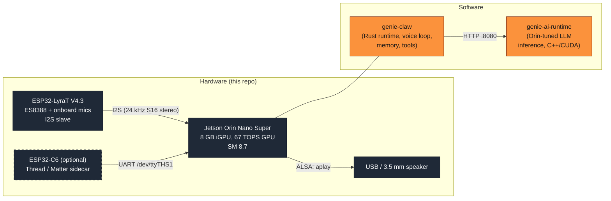
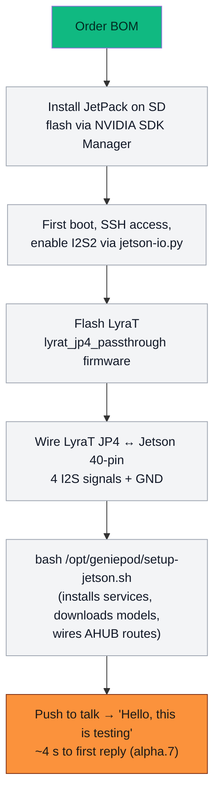

# genie-hardware

Open hardware reference designs for **GenieClaw**, a local home AI
assistant. This is the physical-side companion to the software
([genie-claw](https://github.com/GeniePod/genie-claw)) and the LLM
runtime ([genie-ai-runtime](https://github.com/GeniePod/genie-ai-runtime)).

<!-- placeholder: photo of the assembled Jetson + LyraT MVP. Drop the
     real image at images/hero-mvp.jpg and this caption will resolve. -->

> **Status:** MVP verified end-to-end on Jetson Orin Nano Super + ESP32-LyraT V4.3 (genie-claw alpha.7, 2026-05-13). Custom interface board, PCB, enclosure, and product-design assets in this repo are in early planning.

## What this repo is for

Three things, in this order of maturity:

1. **MVP — documented, working today.** Take off-the-shelf boards, wire them per [`mvp/wiring.md`](mvp/wiring.md), flash one ESP32 firmware, run one setup script. You have a working assistant in an afternoon.
2. **Custom interface board — schematics + PCB layout (planned).** Replace the loose jumper wires with a tidy purpose-built board so the MVP can move from "hack on the desk" to "fits in a case."
3. **Productizable build — enclosure CAD + industrial design (planned).** A 3D-printable developer-kit enclosure, then a manufacturable consumer enclosure with a coherent design language.

Everything here is licensed [**CERN-OHL-S v2**](LICENSE.md) (Strongly Reciprocal). Make whatever you want; share your modifications back under the same license.

## System at a glance

Hardware sits on top of the device-tree overlay; software in the boxes
on the right is what runs on the Jetson. The fully-rendered architecture
diagrams (one per subsystem — voice pipeline, LLM runtime, OS bring-up,
security, ESP32 integration, memory flow) live in
[genie-claw / doc / workflow / prompt.md](https://github.com/GeniePod/genie-claw/blob/main/doc/workflow/prompt.md);
drop the rendered PNGs into [`images/`](images/) and link them here.

## Folder map

| Folder | Status | What it holds |
| --- | --- | --- |
| [**`mvp/`**](mvp/) | working today | BOM, wiring, setup checklist for the off-the-shelf reference build |
| [**`schematic/`**](schematic/) | planned | KiCad schematics for custom interface boards |
| [**`pcb/`**](pcb/) | planned | KiCad PCB layouts, Gerbers, fab outputs, renders |
| [**`enclosure/`**](enclosure/) | planned | Fusion 360 / STEP / STL for cases and grilles |
| [**`product-design/`**](product-design/) | planned | Industrial design, identity, packaging, unboxing |
| [`images/`](images/) | populated as photos arrive | Hero shots and rendered diagrams |

## MVP at a glance

The currently-shippable build, validated on genie-claw alpha.7:

| Component | Part | Approx USD |
| --- | --- | --- |
| Compute | Jetson Orin Nano Super Devkit (8 GB) | $499 |
| Mic frontend | ESP32-LyraT V4.3 (ES8388 + 3 onboard mics) | $30-40 |
| Storage | microSD A2 U3 64 GB+ | $15 |
| Audio out | USB-A headphone or 3.5 mm speaker | $5-30 |
| Wiring | 40-pin GPIO ribbon + Dupont jumpers (4 I2S wires) | $5 |
| **Total (core)** | | **~$550** |

Optional: ESP32-C6 sidecar for Thread/Matter (+$10-15), upgraded speakers, HDMI display for first-boot. Full BOM in [`mvp/bom.md`](mvp/bom.md), wiring in [`mvp/wiring.md`](mvp/wiring.md).

<!-- placeholder: render of the wire-up between LyraT JP4 and Jetson 40-pin.
     Will be drawn properly once schematic/interface-board-v0p1 lands. -->

## Bring-up sequence

Full setup walkthrough lives in [genie-claw / README](https://github.com/GeniePod/genie-claw#alpha5-verified-deploy-2026-05-11), with the alpha.7 verification numbers in the
[Alpha.7 Verified Voice Cycle](https://github.com/GeniePod/genie-claw#alpha7-verified-voice-cycle-2026-05-13) section.

## Roadmap

- **Now:** MVP documented, working. Anyone with the BOM can reproduce.
- **Next (interface-board v0.1):** lift loose jumpers off the desk into a captive connector. Adds ESP32-C6 footprint and audio passthrough on a 2-layer board.
- **Then (developer-kit enclosure v0.1):** 3D-printable case in PLA, M3 inserts only. Mic-to-speaker spacing ≥ 8 cm so half-duplex / AEC fixes can do their job.
- **Eventually (consumer enclosure):** manufacturable design, finished surface, packaging, unboxing flow. That's `product-design/`'s job.

## Related repos

| Repo | What it is |
| --- | --- |
| [GeniePod/genie-claw](https://github.com/GeniePod/genie-claw) | Rust runtime: voice loop, memory, tools, Home Assistant integration. AGPL-3.0. |
| [GeniePod/genie-ai-runtime](https://github.com/GeniePod/genie-ai-runtime) | Orin-tuned C++/CUDA LLM inference runtime. MIT. |
| [GeniePod/genie-os](https://github.com/GeniePod/genie-os) | Jetson OS / image builds for shipping. |
| [GeniePod/genie-hub](https://github.com/GeniePod/genie-hub) | Cloud-side coordination (optional). |
| [GeniePod/genie-app](https://github.com/GeniePod/genie-app) | Companion mobile/desktop client. |
| [ai-hpc/esp-adf](https://github.com/ai-hpc/esp-adf) | LyraT firmware fork including the `lyrat_jp4_passthrough` example. |

## License

CERN Open Hardware Licence Version 2 — Strongly Reciprocal. See [LICENSE.md](LICENSE.md).

This is the hardware analog of AGPL-3.0: you can build, modify, and sell hardware based on these designs, but if you distribute (or operate as a service) a modified design, you must publish the modifications under the same license. Keeps the hardware lineage open.
