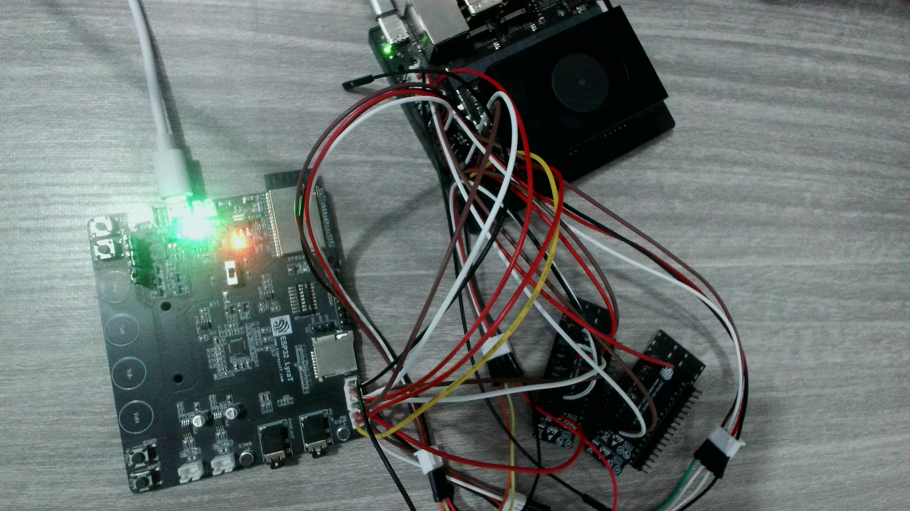

# MVP Wiring

Pin-by-pin connections for the alpha.7-verified MVP. Power off everything
before changing wires; the Jetson 40-pin header is 1.8 V logic only —
do NOT touch a 5 V ESP32 GPIO to it.



The photo above shows the canonical wiring used during the alpha.7
verification: ESP32-LyraT V4.3 (left, USB-powered, status LEDs lit),
Jetson Orin Nano Super Devkit (top right, with the fan/heatsink stack
visible), and — critically — a **passive 40-pin GPIO breakout board**
(lower right) that turns the Jetson's tight 0.1" header into something
that can hold loose Dupont jumpers without strain. Do not try to wire
straight into the Jetson 40-pin; use a breakout. It's $5-10 and saves
hours of debugging intermittent connections.

### Wire-color convention (matches the hero photo)

Not load-bearing, but pick distinct colors per signal so a future
operator can debug visually without tracing every wire end-to-end.
The reference build uses:

| Signal | Color in photo |
| --- | --- |
| MCLK   | yellow |
| SCLK   | white |
| LRCK   | brown |
| ASDOUT | green |
| GND    | black |
| 3V3 (LyraT power, only if needed) | red |

## ESP32-LyraT V4.3 → Jetson Orin Nano (40-pin header)

The LyraT exposes I2S on its **JP4** header. Wire four lines to the
Jetson 40-pin. All signals are 1.8 V logic on the Jetson side, which the
LyraT JP4 already speaks — no level shifter needed.

| Signal | LyraT JP4 pin | Jetson pin (40-pin) | Jetson SoC GPIO | Notes |
| --- | --- | --- | --- | --- |
| **MCLK** | JP4-MCLK | Pin 7 | GPIO 0 | Master clock from LyraT; ES8388 generates it. |
| **SCLK / BCLK** | JP4-SCLK | Pin 29 | GPIO 5 | Bit clock. |
| **LRCK / WS** | JP4-LRCK | Pin 22 | GPIO 25 | Word select / frame clock. 24 kHz on the wire even though firmware claims 48 kHz — see [genie-claw issue #1](https://github.com/GeniePod/genie-claw/issues/1). |
| **ASDOUT / SD** | JP4-ASDOUT | Pin 16 | GPIO 35 | Audio data, LyraT → Jetson. |
| **GND** | JP4-GND | Pin 6, 9, 14, … | — | Any 40-pin GND will do; tie one. |

LyraT itself is powered via its **USB-micro-B** port (same one used for
firmware flashing). Plug it into the same USB hub or PSU as the Jetson.

## ESP32-C6 (optional Thread/Matter sidecar) → Jetson UART

| Signal | C6 pin | Jetson 40-pin | Notes |
| --- | --- | --- | --- |
| TX (C6 → Jetson RX) | GPIO 16 | Pin 10 (UART1_RX, `/dev/ttyTHS1`) | 115200 baud, 8N1 |
| RX (Jetson TX → C6) | GPIO 17 | Pin 8 (UART1_TX) | |
| RESET (optional) | EN | Pin 18 (GPIO 24) | Lets genie-core reset the C6 from software. |
| GND | GND | Pin 6 | |

Configured under `[connectivity]` / `[connectivity.esp32c6_uart]` in
`/etc/geniepod/geniepod.toml` (see genie-claw deploy config). Disabled
by default.

## USB / power

- **Jetson power:** included DC barrel jack. Use the supplied 19 V
  brick for sustained inference; USB-C PD works too but draws Jetson
  back to a 15 W power mode.
- **Speaker / headphone:** USB-A on the Jetson carrier, OR 3.5 mm out
  on the Jetson devkit's audio jack. `audio_output_device = "auto"` in
  geniepod.toml picks the right one. Avoid HDMI audio routing —
  unstable on some L4T versions.
- **Network:** wired Ethernet preferred (gigabit on the carrier). WiFi
  works for HA / MQTT / Telegram but adds jitter to remote tool calls.

## After wiring

1. Boot Jetson, log in.
2. Apply the Jetson 40-pin I2S2 device-tree overlay:
   ```
   sudo /opt/nvidia/jetson-io/jetson-io.py
   ```
   Select **Configure 40-pin header** → enable **i2s2** → save and
   reboot.
3. Flash the LyraT firmware — build the `lyrat_jp4_passthrough` example
   from a local clone of
   [espressif/esp-adf](https://github.com/espressif/esp-adf) (proposed
   for upstream inclusion in
   [issue #1607](https://github.com/espressif/esp-adf/issues/1607)),
   then flash via the LyraT's USB-micro-B port.
4. Run `bash /opt/geniepod/setup-jetson.sh` to install audio init +
   service units.
5. Verify with `arecord -D plughw:APE,0 -c 2 -r 24000 -f S16_LE -d 3
   /tmp/test.wav && aplay /tmp/test.wav` — you should hear your voice
   back through whatever speaker you wired.

## Diagram

A schematic / wiring drawing of all this will live in
[`../schematic/`](../schematic/) once the first PCB iteration starts.
For now the MVP is wired by hand from the table above; that's the
documentation.
